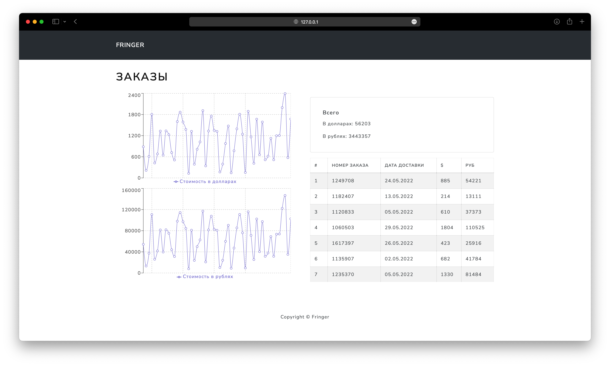

# Test Orders Project

Проект для получения заказов из google таблицы и вывода их на сайт.



## Установка

### 1. Сделайте копию репозитория

 ```
 git clone https://github.com/fringer2423/TestOrderPrj.git
 ```

### 2. Перейдите в папку с проектом

```
cd TestOrderPrj
```

### 3. Задайте переменные окружения

Создайте файл .env.dev на основе [.env.dev.example](app/.env.dev.example) в папке app

```
DEBUG=1
SECRET_KEY=your_secret_key
DJANGO_ALLOWED_HOSTS=localhost 127.0.0.1 [::1]
SQL_ENGINE=your_db_engine
SQL_DATABASE=your_db_database_name
SQL_USER=your_db_user
SQL_PASSWORD=your_db_password
SQL_HOST=your_db_host
SQL_PORT=your_db_port
DATABASE=your_db
SHEET_KEY=your_sheet_key
```

### 4. Создайте проект на google cloud

Сервис [тут](https://console.cloud.google.com/)

* Нужно добавить в проект Google Sheets API
* Создать учетные данные и получить creds.json с данными для подключения к проекту (его сохранить в app/scripts<
  creds.json>)

Подробнее можно почитать [тут](https://developers.google.com/sheets/api/quickstart/quickstarts-overview)
и [тут](https://developers.google.com/sheets/api/guides/concepts)

### 5. Запустите контейнер

* Проверьте, что получили и сохранили creds.json(Данные для доступа к API google)
* Проверьте, что правильно создали .env.dev в папке app
* Проверьте, что добавили ключ для таблицы google в .env.dev, поле SHEET_KEY(Сам ключ можно найти например в ссылке на
  вашу табличку)
* Проверьте, что у вас установлен docker

Если все готово, запускаем 

``` 
docker-compose up -d --build
```

Для остановки контейнера используем 
```
docker-compose down -v
```

Дождитесь запуска контейнера + 30 секунд после 

Откройте проект локально по ссылке [http://127.0.0.1:8009/](http://127.0.0.1:8009/)

### 6. Пользуйтесь =)